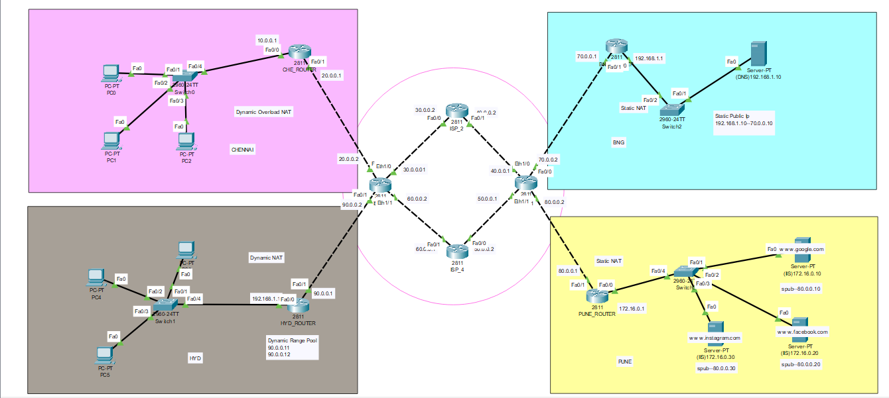

# Enterprise WAN using GRE & NAT

A Cisco Packet Tracer project that simulates a multi-site Enterprise Wide Area Network (WAN) connecting geographically distributed branch offices through an ISP backbone. The project demonstrates enterprise-grade networking concepts including **GRE Tunnel**, **Dynamic NAT**, **Static NAT**, and **PAT (NAT Overload)** for secure communication, efficient IPv4 address utilization, and public service hosting.

---

## Network Topology



---

## Project Overview

This project models a real-world enterprise WAN where multiple branch offices communicate through an ISP backbone. A GRE tunnel is configured between the **Chennai** and **Pune** branches to establish secure logical connectivity. Different NAT techniques are implemented across branch offices to provide Internet connectivity while DNS and HTTP servers simulate enterprise network services.

---

## Features

- Multi-Site Enterprise WAN Architecture
- GRE Tunnel (Chennai ↔ Pune)
- ISP Backbone Connectivity
- Dynamic NAT
- Static NAT
- PAT (NAT Overload)
- DNS Server Configuration
- Public Web Server Hosting
- Branch Office Connectivity
- End-to-End Network Verification
- Enterprise Routing Infrastructure

---

## Network Architecture

### Branch Offices

- Chennai Branch
- Hyderabad Branch
- Engineering Branch
- Pune Branch

### ISP Backbone

- Multi-router WAN Infrastructure
- Static Routing Between Sites
- GRE Tunnel Between Chennai and Pune

### Network Services

- Dynamic NAT
- Static NAT
- PAT (NAT Overload)
- DNS Server
- HTTP Web Servers

---

## GRE & NAT Implementation

| Technology | Purpose |
|------------|---------|
| GRE Tunnel | Secure logical connectivity between Chennai and Pune branches |
| Dynamic NAT | Maps private IP addresses to a pool of public IP addresses |
| Static NAT | Maps internal servers to fixed public IP addresses |
| PAT (NAT Overload) | Allows multiple devices to share a single public IP address |

---

## Technologies Used

- Cisco Packet Tracer
- Cisco IOS CLI
- Cisco 2811 Routers
- Cisco 2960 Switches
- IPv4 Addressing
- GRE Tunnel
- Dynamic NAT
- Static NAT
- PAT (NAT Overload)
- Static Routing
- DNS
- HTTP

---

## Project Files

| File | Description |
|------|-------------|
| `Project_GRE_VPN.pkt` | Cisco Packet Tracer project |
| `Topology_Design.png` | Enterprise WAN topology |
| `Output(1).png` | Browser connectivity verification |
| `README.md` | Project documentation |

---

## Verification

The project successfully demonstrates:

- ✅ GRE Tunnel Connectivity
- ✅ Dynamic NAT Translation
- ✅ Static NAT Configuration
- ✅ PAT (NAT Overload)
- ✅ Branch-to-Branch Communication
- ✅ Internet Connectivity
- ✅ DNS Name Resolution
- ✅ HTTP Website Accessibility
- ✅ End-to-End WAN Routing

---

## Output

The following screenshot verifies successful access to the hosted web server through the enterprise WAN, demonstrating correct routing, NAT translation, DNS resolution, and HTTP service availability.

.png)

---

## Real-World Applications

This architecture is applicable to:

- Corporate Enterprises
- Banking Networks
- Educational Institutions
- Government Organizations
- IT Service Providers
- Multi-Branch Companies

---

## Learning Outcomes

- Enterprise WAN Design
- GRE Tunnel Configuration
- Dynamic NAT Configuration
- Static NAT Configuration
- PAT (NAT Overload)
- Static Routing
- DNS Configuration
- HTTP Server Configuration
- Cisco IOS CLI
- Enterprise Network Troubleshooting

---

## Prerequisites

- Cisco Packet Tracer 8.x or later

### Basic Knowledge

- Computer Networks
- IPv4 Addressing
- Routing Concepts
- Cisco IOS CLI
- NAT
- GRE Tunnel

---

## How to Run

1. Clone the repository.

```bash
git clone https://github.com/praveen272004/Enterprise-WAN-using-GRE-NAT.git
```

2. Open **Project_GRE_VPN.pkt** using Cisco Packet Tracer.

3. Run the project in **Realtime** or **Simulation** mode.

4. Verify:
   - GRE Tunnel Connectivity
   - Dynamic NAT Translation
   - Static NAT Mappings
   - PAT (NAT Overload)
   - Branch-to-Branch Communication
   - DNS Resolution
   - HTTP Website Accessibility

---

## Case Study

A growing enterprise with branch offices in **Chennai, Hyderabad, Engineering, and Pune** requires secure communication between geographically distributed locations while providing Internet connectivity and public-facing services. This project simulates an ISP-connected WAN where a **GRE tunnel securely connects the Chennai and Pune branches**, Dynamic NAT and PAT provide Internet access for internal users, and Static NAT publishes enterprise web and DNS servers. The solution demonstrates scalable WAN architecture, efficient IPv4 address utilization, secure inter-branch communication, and enterprise-grade network services.

---

## Author

**Praveen M**

Electronics and Communication Engineering (ECE)

---

⭐ If you found this project useful, consider giving it a **Star** on GitHub!
